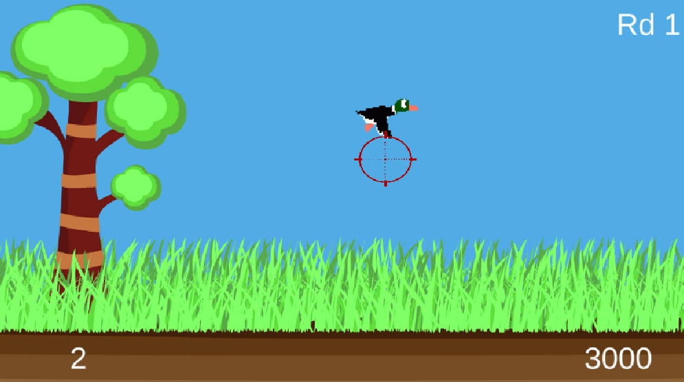

# Unity_DuckHunt

## About 
This project is a DuckHunt clone built with Unity and written in C#. It aims to recreate the nostalgic gameplay of the classic DuckHunt game, where the player takes on the role of a hunter and attempts to shoot down ducks flying across the screen.

## Gameplay
The DuckHunt clone consists of two rounds, each with two ducks flying in random directions. The objective is to shoot down as many ducks as possible within the given time limit.

## Features
* Simple aiming and shooting mechanics: Use the mouse or touch input to aim and shoot at the ducks.
* Randomized duck behavior: Each round features two ducks that fly in random directions, providing a dynamic and challenging experience.
* Scoring system: Earn points for each successfully shot duck. The score is displayed on the screen, and you can track your progress and aim for high scores.

## Installation

To run the game on your local machine, follow these steps:
```
1. Clone the repository or download the source code as a ZIP file.

2. Open Unity and navigate to the project folder.

3. Open the project in Unity by selecting the folder and clicking "Open."

4. Once the project is open, navigate to the "Scenes" folder and open the "Main" scene.

5. Connect a supported platform (such as your mobile device or Unity's Play Mode) to run the game.

6. Build and run the project.
```
